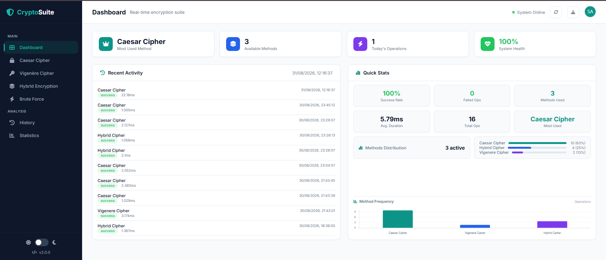

<h1 align="center">🔐 CryptoSuite</h1>

<p align="center">
  <strong>A Professional Encryption &amp; Decryption Suite</strong>
  <br>
</p>

<p align="center">
  
  
  
  
  
  
  
</p>

---

# 📖 Introduction

In the digital age, **data confidentiality** is paramount. Encryption serves as the cornerstone of cybersecurity, ensuring that sensitive information remains protected from unauthorized access. This project, **CryptoSuite**, serves as the **cryptographic phase** of the DecodeLabs training program.

CryptoSuite is a professional-grade encryption/decryption web application that demonstrates the implementation of multiple encryption techniques. By combining **classical ciphers** (Caesar, Vigenère) with **modern hybrid approaches**, this tool provides a comprehensive, hands-on experience in cryptographic logic.

The application features a **real-time dashboard**, **historical logging**, **data visualization**, and a **dual-theme interface**—offering a complete, enterprise-ready user experience.

---

# 🎥 Video Demonstration

<p align="center">
  <a href="https://youtu.be/esLVUJguQ1g">
    
  </a>
</p>

<p align="center"><strong>Watch the full demonstration here</strong></p>

---

# 📸 Project Screenshots

### Dashboard 
<p align="center">
  
</p>


### 📊 Statistics & Analytics
<p align="center">
  
</p>

---

# ✨ Key Features

- 🔐 **Multiple Encryption Techniques:** Caesar Cipher, Vigenère Cipher, and Hybrid Encryption (Two-layer security).
- 🔓 **Brute Force Attack Simulation:** Crack Caesar cipher using frequency analysis.
- 📊 **Real-Time Dashboard:** Total operations, success rate, method distribution, and system health monitoring.
- 📈 **Advanced Analytics:** Method breakdown, distribution charts, and operations timeline.
- 📋 **Complete History Logging:** All encryption operations logged with timestamps and metadata.
- 🎨 **Dual Theme (Instant Switch):** Dark/Light modes with smooth transitions and persistence.
- ⚡ **Real-Time Updates:** WebSocket integration for live dashboard updates.
- 💾 **Export Functionality:** Export logs as JSON for external analysis.

---

# 🛠️ Technologies Used

| <strong>Technology</strong> | <strong>Purpose</strong> |
| :--- | :--- |
| **Python** | Backend Logic & Encryption Engine |
| **Flask** | Web Framework & API Routing |
| **Flask-SQLAlchemy** | Database ORM |
| **Flask-SocketIO** | Real-time WebSocket Communication |
| **SQLite / MySQL** | Persistent Data Storage |
| **HTML5 / CSS3** | Responsive UI, Animations, Theming |
| **JavaScript (ES6+)** | Frontend Logic, Chart.js, DOM Manipulation |
| **Chart.js** | Data Visualization |
| **Font Awesome** | Icons & Visual Enhancements |

---

# 🚀 How to Run Locally

### Prerequisites
- Python 3.8 or higher installed ([Download](https://python.org))
- pip (Python package manager)

### Step 1: Clone the Repository
```bash
git clone https://github.com/warshia-rubab/CryptoSuite.git
cd CryptoSuite
Step 2: Create Virtual Environment
bash
# Windows
python -m venv venv
venv\Scripts\activate

# Mac/Linux
python3 -m venv venv
source venv/bin/activate
Step 3: Install Dependencies
bash
pip install -r requirements.txt
Step 4: Run the Application
bash
cd backend
python app.py
Step 5: Open Browser
text
http://cryptosuite.com:5000
Or use: http://localhost:5000

📂 File Structure
text
📁 CryptoSuite/
│
├── 📁 backend/
│   ├── 📄 app.py                  # Main Flask Application
│   ├── 📄 encryption_engine.py    # Encryption Logic Engine
│   ├── 📄 caesar_cipher.py        # Caesar Cipher Implementation
│   ├── 📄 vigenere_cipher.py      # Vigenère Cipher Implementation
│   ├── 📄 hybrid.py               # Hybrid Cipher Implementation
│   └── 📄 utils.py                # Utility Functions
│
├── 📁 frontend/
│   ├── 📄 index.html              # Main Dashboard UI
│   ├── 📁 css/
│   │   ├── 🎨 style.css           # Main Styles
│   │   └── 🎨 theme.css           # Theme Management
│   └── 📁 js/
│       ├── ⚙️ main.js             # Main Application Logic
│       ├── ⚙️ encryption.js       # Encryption Functions
│       └── ⚙️ theme.js            # Theme Toggle
│
├── 📁 database/                   # SQLite Database (auto-created)
├── 📁 logs/                       # Application Logs
├── 📁 exports/                    # Export Files
├── 📁 screenshots/                # Screenshots for README
│
├── 📄 requirements.txt            # Python Dependencies
├── 📄 README.md                   # Documentation
└── 📄 .gitignore                  # Git Ignore Rules
🔗 API Endpoints
Endpoint	Method	Description
/api/encrypt/caesar	POST	Caesar cipher encryption
/api/encrypt/vigenere	POST	Vigenère cipher encryption
/api/encrypt/hybrid	POST	Hybrid encryption
/api/bruteforce	POST	Brute force attack simulation
/api/history	GET	Retrieve encryption history
/api/stats	GET	Retrieve statistical analysis
/api/export	GET	Export logs as JSON
📄 License
This project is developed for educational and training purposes as part of the DecodeLabs Industrial Training Program (Batch 2026).

It is licensed under the MIT License. This means you are free to use, modify, and distribute this software for personal or educational projects, provided that the original copyright notice and permission notice are included in all copies or substantial portions of the software.

🛡️ Credits
Organization: DecodeLabs

Program: Industrial Training Program (Batch 2026)

Track: Cryptographic Logic

Role: Cybersecurity Analyst

Author: Warshia Rubab

Disclaimer: This tool is intended for educational purposes only. It is designed to help users understand cryptographic principles and should not be used as a substitute for professional-grade enterprise security solutions.
